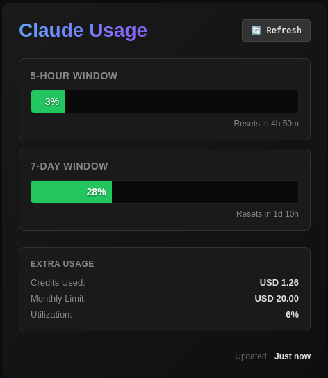

<a href="https://claude.ai">
    
</a>

# Claude Usage

A small app that monitors your Claude usage in real time.



## Installation

### Ubuntu/Debian, RHEL, Windows, Mac
See releases for latest pre-build 

### Arch
```
Clone the repo
run makepkg -si in pkg/
```

> **Disclaimer:** This app uses an unofficial, undocumented Anthropic API endpoint (`/api/oauth/usage`) that is also used internally by the Claude CLI. It is not part of Anthropic's public API and may change or break without notice. This project is not affiliated with or endorsed by Anthropic.

## License

MIT — see [LICENSE](LICENSE).
